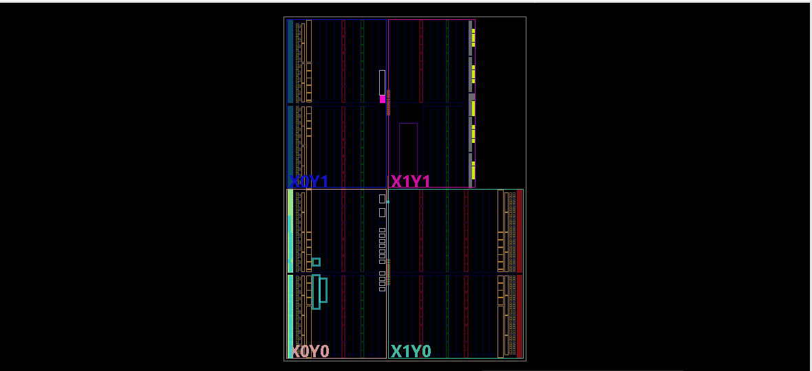

# **Electronic Voting Machine (EVM) using Verilog**  

 *(Replace with actual image if available)*  

## 📌 **Project Overview**  
This project implements an **Electronic Voting Machine (EVM) using Verilog**, designed to count votes for four candidates and determine the winner based on the highest vote count. The system is simulated in **Vivado**, with results verified using testbench waveforms.  

## 🚀 **Technologies & Tools Used**  
- **Verilog** – Digital logic design and simulation  
- **Vivado** – RTL simulation and waveform analysis  
- **Finite State Machine (FSM)** – Implements vote counting logic  
- **Behavioral & Structural Modeling** – Used in Verilog for modular design  

## 🔧 **Project Features**  
✅ **Vote Counting for Four Candidates** – Each candidate's votes are counted and stored.  
✅ **Finite State Machine (FSM) Based Logic** – Ensures proper state transitions after each vote.  
✅ **Winner Detection** – Determines the candidate with the highest votes.  
✅ **Testbench Validation** – Ensures correctness using simulation in **Vivado**.  

## 📂 **Project Structure**  
```
📂 EVM-Project/
 ├── 📄 EVM.v             # Main Verilog module (Electronic Voting Machine logic)
 ├── 📄 EVM_tb.v          # Testbench file for simulation
 ├── 🖼️ output1.png   # Simulation output - Initial state
 ├── 🖼️ output2.png   # Simulation output - Voting process
 ├── 🖼️ output3.png   # Simulation output - Vote counts
 ├── 🖼️ output4.png   # Simulation output - Winner selection
 ├── 📝 README.md         # Project documentation (this file)
```

## 🛠 **Installation & Simulation Guide**  
### **1️⃣ Clone the Repository**  
```bash
git clone https://github.com/Aneket-Burman/EVM-Project.git
cd EVM-Project
```

### **2️⃣ Open the Project in Vivado**  
1. Launch **Vivado** and create a new **RTL Project**.  
2. Add **`EVM.v`** to **Design Sources**.  
3. Add **`EVM_tb.v`** to **Simulation Sources**.  

### **3️⃣ Run the Simulation**  
1. Go to **Flow Navigator → Simulation → Run Behavioral Simulation**.  
2. Observe the waveform outputs in **Vivado’s Simulation Window**.  
3. Verify vote counting and **winner selection logic**.  

### **4️⃣ Expected Output**  
- The **waveforms** should display vote counts for each candidate.  
- The **winner signal** should correctly identify the candidate with the highest votes.  
- Check the **output images** in the `Outputs/` folder for expected results.  

## 📸 **Simulation Results**  
*(Add simulation screenshots here)*  

## 🔗 **GitHub Repository**  
[👉 Electronic Voting Machine in Verilog](https://github.com/Itwgd98/EVM_Verilog)
---

This **README** provides a clear **project structure**, **simulation guide**, and **expected results**, ensuring **high ATS (Applicant Tracking System) compatibility** for resumes and professional portfolios. 🚀 Let me know if you need modifications! 😊
